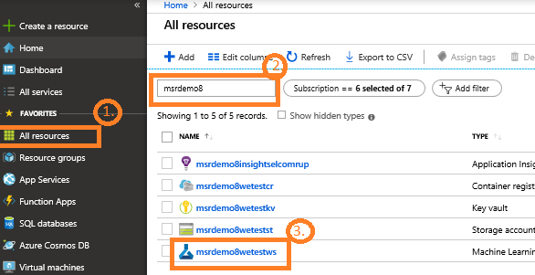
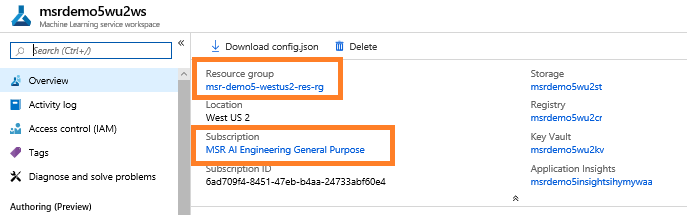

# How to retrieve subscription ID, resource group, and workspace name

If you need you can retrieve the workspace, subscription id and resource group name from the Azure portal.

1. Log into Azure portal
2. Click **All resources** 
3. Search on your department and team name

4. Click the workspace resource.

5. Find the subscription ID, the resource group name, the storage account name, and the key vault name.