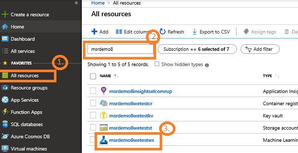

# Run on Azure Machine Learning service

The document shows how a you can run your job in Azure Machine Learning service when it is set up to be used within an organization.

## Prerequisites

The following are prerequisites to running your job in an admin-managed workspace Azure Machine Learning services.

- Complete [Setup](setup.md) of your development system including conda, Azure Machine Learning services for Python SDK, and the AML widgets.
- Admin has copied [set up](admin/setup.md) the Dogbreeds data store for you organization and a workspace and resources for your team, and set up key vault for the storage.

You have set environment variables to your data and workspace:

- AZURE_STORAGE_ACCOUNT=<data_account_name> 
- AZURE_STORAGE_CONTAINER=<demo_data_storage_container> 
- RESOURCEGROUP_NAME=<resourcegroup_name>
- SUBSCRIPTION_ID=<subscription_id>
- AZURE_STORAGE_KEY=<access_key_to_storage_account>

In PowerShell these environment variables would be `$env:_ `and on Linux these environment variables need to be exported.
See [Readme](readme.md) for details.

You will have logged into Azure and have started the Jupyter Notebook.

Be familiar with the concepts of workspace, experiments, compute target in Azure Machine Learning services.

## Get workspace name, resource group naem, and subscription ID from portal

If you need you can retrieve the workspace, subscription id and resource group name from the Azure portal.

1. Log into Azure portal.
2. Click **All resources**.
3. Search using your department and team name.

4. Click the workspace resource.

5. Find the subscription ID, the resource group name, the storage account name, and the key vault name.

